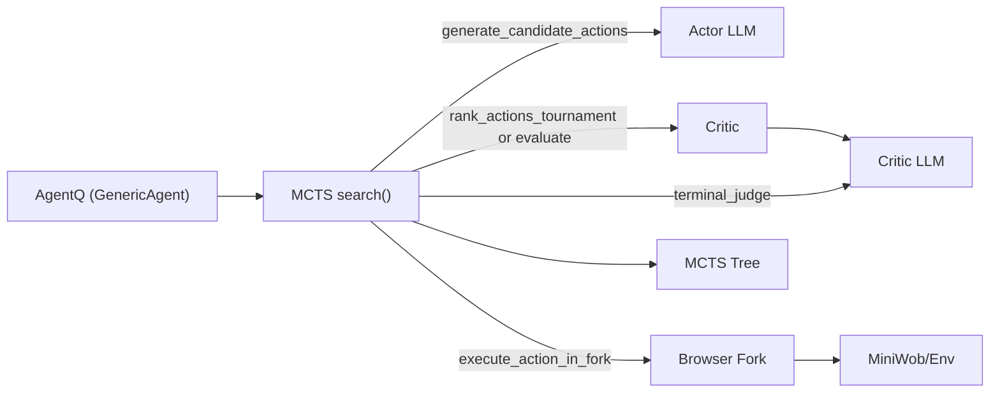
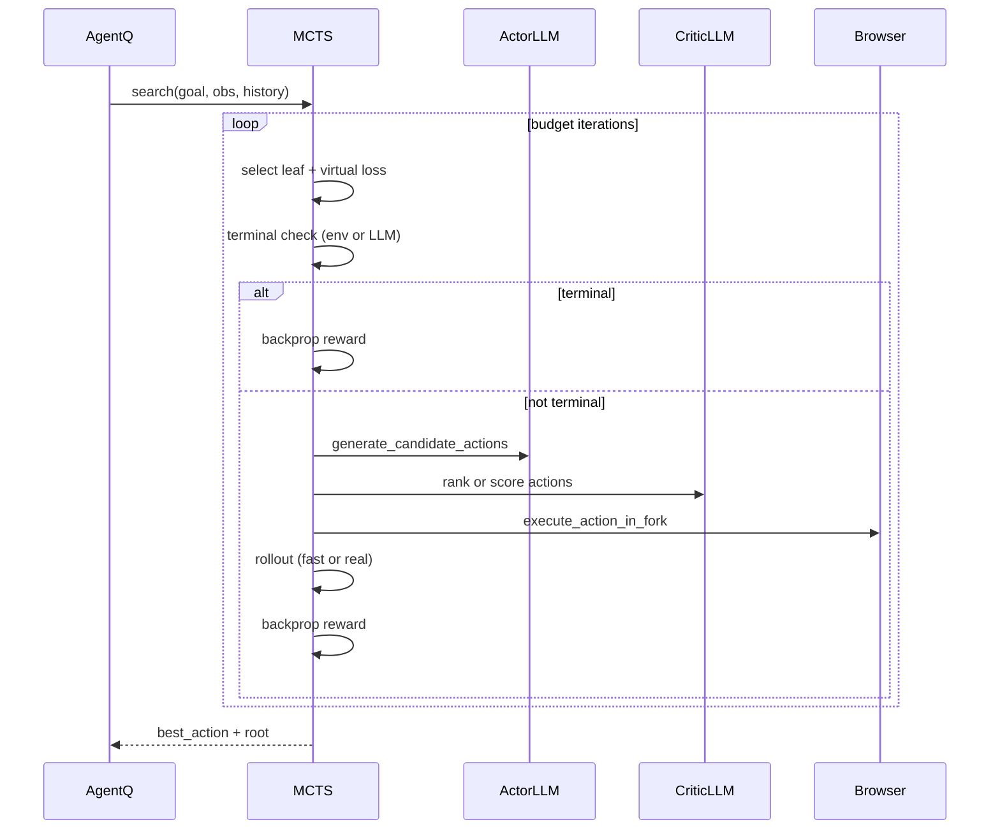

# AgentQ MCTS Overview

This document explains how the AgentQ MCTS implementation works and how it integrates the critic and browser execution pipeline. It is based on:

- `src/agentlab/agents/agentq/mcts.py`
- `src/agentlab/agents/agentq/evaluators.py`
- `src/agentlab/agents/agentq/agentq.py`

## Components

## High-Level Flow

AgentQ builds a goal string from the observation and delegates action selection to MCTS. MCTS runs multiple iterations to explore candidate actions, uses a critic to score them, simulates execution through a forked browser, and backpropagates rewards through the search tree. The best action is returned to AgentQ, which updates its history and optionally generates DPO preference pairs.

### Sequence of a Single MCTS Search

## Core Steps in `mcts.py`

1. **Selection**
   - Traverses the tree using UCB1 with mixed Q-values.
   - Applies a virtual loss to avoid repeated selection by parallel workers.

2. **Terminal Check**
   - Fast path: checks environment reward in `obs["metadata"]["reward"]`.
   - Slow path: calls the terminal judge prompt through the critic LLM.

3. **Expansion**
   - `generate_candidate_actions()` calls the actor LLM to propose actions.
   - `TournamentCritic` ranks actions in a batch; `AbsoluteCritic` scores each action.

4. **Simulation**
   - `use_real_rollouts=False`: execute the first action in the browser, then use fast rewards.
   - `use_real_rollouts=True`: execute multiple actions via a forked browser rollout.
   - `use_env_reward=True` switches to sparse reward (0/1), bypassing critique scoring.

5. **Backpropagation**
   - Reward flows back through the tree, updating visits and cumulative value.

6. **Action Selection**
   - Selector picks the best child after the budget is exhausted (default: max visits).

## Critic Behavior in `evaluators.py`

- **AbsoluteCritic**: scores each action independently with the critic LLM.
- **TournamentCritic**: ranks multiple actions in a single LLM call, producing a descending rank-based score.
- Both reuse observation prompt caching to reduce repeated prompt construction.

## Agent Integration in `agentq.py`

AgentQ:
- Preprocesses observations and builds action history.
- Runs `MCTS.search()` with `mcts_budget` and `mcts_max_workers`.
- Generates DPO preference pairs from the resulting tree for in-context learning.

## Improvement Levers

These are the primary optimization and quality levers, with code locations:

- **Action generation cost** (`generate_candidate_actions` in `mcts.py`): reduce prompt size, add caching, or reduce branching factor `n`.
- **Critic cost** (`rank_actions_tournament`, `evaluate` in `evaluators.py`): favor tournament ranking to reduce LLM calls.
- **Simulation cost** (`_simulate_with_fast_rewards`, `_simulate_with_real_rollouts` in `mcts.py`): lower `rollout_depth`, keep `use_real_rollouts=False` for speed.
- **Reward mode** (`use_env_reward` in `mcts.py` / `agentq.py`): use sparse rewards to avoid critique calls, at potential accuracy cost.
- **Parallelism** (`search` in `mcts.py`): tune `mcts_max_workers` and `AGENTQ_MCTS_SIM_WORKERS` to avoid starvation.
- **Caching** (`_get_obs_prompt_cached`, `_terminal_cache`, `_critic_cache` in `mcts.py`): reduce repeated LLM input construction and repeated scoring.

## Config Knobs to Know

- `mcts_budget`, `mcts_max_workers`, `mcts_rollout_depth`
- `use_real_rollouts`, `use_env_reward`
- `alpha`, `q_threshold`
- `iteration_timeout`
- `mcts_debug_logging`, `browser_fork_logging`

