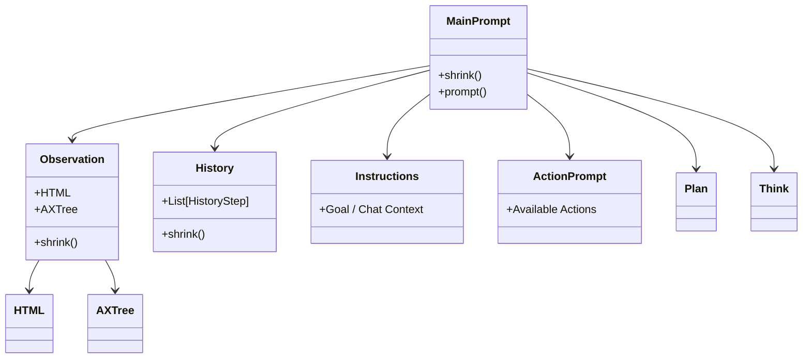
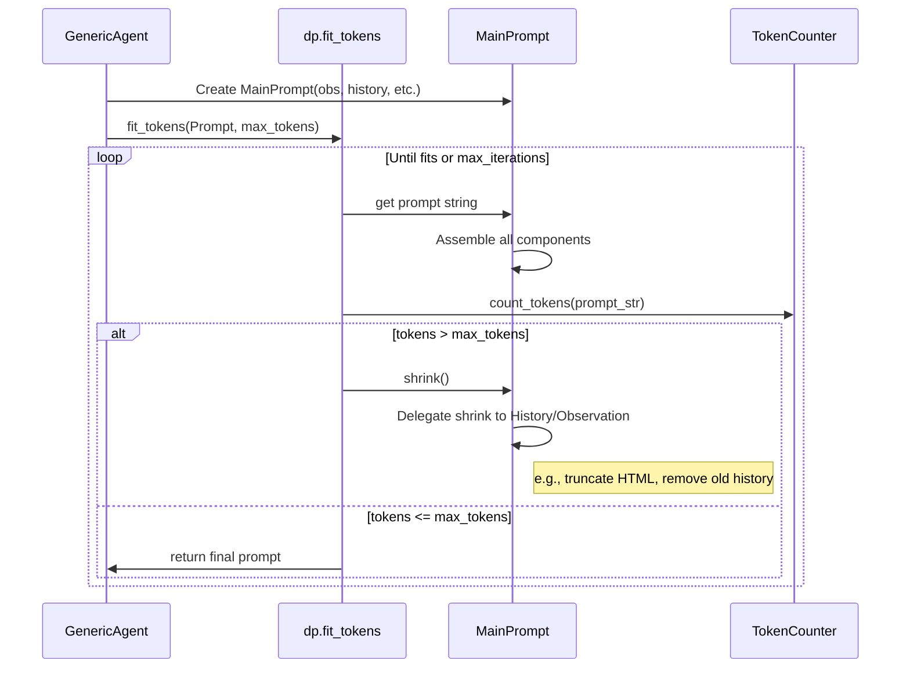

# Dynamic Prompting in AgentLab

This document provides an overview of the **Dynamic Prompting** mechanism used in `GenericAgent` and related classes. This system is designed to handle the variable and often large context associated with browser automation (HTML, Accessibility Trees, History) within the fixed token limits of LLMs.

## Core Concept: "Shrinkable" Prompts

The central idea is that the prompt is not a static string but a **structured object** composed of multiple elements. Some of these elements are **Shrinkable**, meaning they can reduce their size (token count) if the total prompt is too large.

### Why is it needed?
Browser observations (HTML, AXTree) and interaction histories can easily exceed the context window of an LLM. Instead of blindly truncating the text, the `dynamic_prompting` module allows for intelligent, prioritized reduction of information.

## Architecture

The system is built on a few key classes found in `src/agentlab/agents/dynamic_prompting.py` and `src/agentlab/agents/generic_agent/generic_agent_prompt.py`.

### 1. `PromptElement`
The base building block. It handles:
- **Visibility**: Whether the element should be included in the prompt (e.g., based on flags).
- **Examples**: Abstract and concrete examples for few-shot prompting.
- **Parsing**: How to extract relevant information from the LLM's response corresponding to this element.

### 2. `Shrinkable` (extends `PromptElement`)
An element that implements a `shrink()` method. When called, it reduces its content.
- **Example**: `Trunkater` (truncates lines from the bottom), `History` (summarizes or removes older steps).

### 3. `MainPrompt`
The top-level container used by `GenericAgent`. It assembles the full user ("human") message.

## The Workflow: `fit_tokens`

The `GenericAgent.get_action` method uses the `dp.fit_tokens` function to generate the final prompt.

### Shrinking Strategies
Different components shrink differently:
- **History**: Older steps might be removed or summarized first.
- **HTML/AXTree**: Can be truncated (removing elements) or filtered (removing attributes).
- **Logs**: Error logs might be truncated to show only the most recent lines.

## System Prompt vs. Human Prompt

You asked about the distinction between the two:

| Prompt Type | Content | Purpose | Variability |
|---|---|---|---|
| **System Prompt** | "You are an agent trying to solve a web task..." | Sets the **Persona** and fundamental rules of behavior. | **Static**: Constant across all steps and tasks. |
| **Human Prompt** | Observations, Goal, History, Available Actions. | Provides the **Context** for the specific current step. | **Dynamic**: Changes every step; shrunk to fit token limits. |

**Why this structure?**
Most Chat APIs (OpenAI, Anthropic) treat the `system` message as a persistent instruction that anchors the model's behavior, while the `user` (human) message represents the current input to process. 
- The **System Prompt** ensures the model stays in character (an agent) and doesn't get confused by the varying content of the web pages.
- The **Human Prompt** (constructed by `MainPrompt`) contains the "data" to process (the webpage). It is called `human_prompt` in the code simply because it maps to the `user` role in the chat conversation format.

## How to Extend

To add new capabilities or information to the agent:

1.  **Define a new Flag**: Add a field to `GenericPromptFlags` in `generic_agent_prompt.py` to control your new feature.
2.  **Create a `PromptElement`**: Subclass `PromptElement` (or `Shrinkable` if it's large) in `dynamic_prompting.py` or `generic_agent_prompt.py`.
    *   Implement `_prompt` to define the text output.
    *   Implement `_parse_answer` if you need to extract new tags from the LLM's response.
3.  **Add to `MainPrompt`**: Instantiate your new element in `MainPrompt.__init__` and add it to the `_prompt` composition logic.
4.  **Register Parsing**: Ensure `MainPrompt._parse_answer` calls your element's parse method to retrieve the data.

